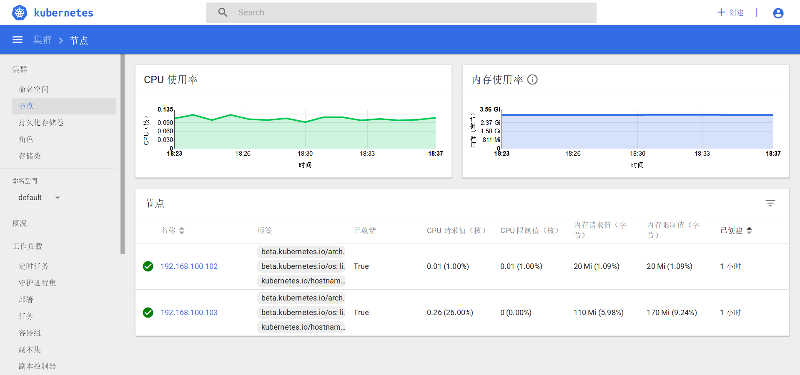
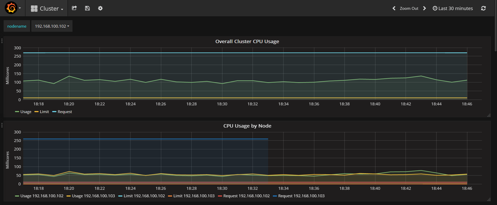

# Kubernetes 部署

## 介绍

本项目通过 Ansible 自动化脚本完成 Kubernetes 集群的一键部署，降低安装成本，提高生产效率

## 截图

**Dashboard**


**Monitoring Grafana**


##  快速体验

### 集群环境

**软件版本**

| 软件名称        | 版本           |
| ------------- |:-------------:|
| centos      | 7.4.1708 |
| docker      | 17.12.0   |
| kubernetes      | 1.9.0 |
| flannel      | 0.9.1    |
| etcd      | 3.2.12    |

**kubernetes 组件版本**

| kubernetes 组件        | 版本           |
| ------------- |:-------------:|
| dashboard      | 1.8.1 |
| kube-dns      | 1.14.7   |
| heapster      | 1.5.0 |
| nginx-ingress      | 0.9.0    |

> kubernetes 相关镜像：https://hub.docker.com/u/ifnoelse/

**机器节点**

| 服务器名      | ip           | 安装的组件           |
| ------------- | ------------- |-------------|
| node-1      | 192.168.100.101 |kubernetes_master，kubernetes_client，flannel，etcd|
| node-2      | 192.168.100.102 |kubernetes_node，flannel，etcd，docker|
| node-3      | 192.168.100.103 |kubernetes_node，flannel，etcd，docker|

> 以上节点通过 Vagrant 准备即可，Vagrantfile 在项目根目录下

### 一键部署

**1 下载部署代码**

``` bash
git clone https://github.com/ifnoelse/kubernetes-deploy.git
```
>由于 ide 或者 git 工具有可能会自动转换换行符为用户 PC 平台的默认换行符，
所以一定要确认 git 上拿下来的文件换行符为 LF，也就是 linux/unix 下的标准换行符，
以避免相关脚本在 linux 机器上无法执行

**2 启动虚拟机**

``` bash
cd kubernetes-deploy
vagrant up
```

**3 下载安装文件**

3.1 复制 res 文件夹到 kubernetes-deploy 目录

res文件夹内的内容如下：
- cfssl-certinfo_linux-amd64
- cfssljson_linux-amd64
- cfssl_linux-amd64
- docker-17.12.0-ce.tgz
- etcd-v3.2.12-linux-amd64.tar.gz
- flannel-v0.9.1-linux-amd64.tar.gz
- kubernetes-server-v1.9.0-linux-amd64.tar.gz

> 1、res 文件夹下载地址：https://pan.baidu.com/s/1kVgn2ib 密码：dsss <br />
> 2、res 中的文件也可以自行到官网下载，之后将压缩包放入 res 目录即可，文件名叫什么都可以
    
3.2 复制 images 文件夹到 kubernetes-deploy 目录（可选步骤）

images文件夹内的内容如下：
- defaultbackend_1.4.tar
- heapster-amd64_v1.5.0.tar
- heapster-grafana-amd64_v4.4.3.tar
- heapster-influxdb-amd64_v1.3.3.tar
- k8s-dns-dnsmasq-nanny-amd64_1.14.7.tar
- k8s-dns-kube-dns-amd64_1.14.7.tar
- k8s-dns-sidecar-amd64_1.14.7.tar
- kubernetes-dashboard-amd64_v1.8.1.tar
- nginx-ingress-controller_0.9.0.tar
- pause-amd64_3.0.tar

> 1、images 文件夹下载地址：https://pan.baidu.com/s/1cAXRsE 密码：ot65 <br />
> 2、如果希望从本导入相关镜像，比如 dashboard 等 kubernetes 相关组件的镜像，则需要下载images文件，不导入也可以，安装相关组件时会从网上自动下载，如果网络不好可能比较慢

**4 一键安装 kubernetes 集群**

登录虚拟机（用户名：ifnoelse，密码：ifnoelse）执行以下命令
``` bash
cd /vagrant/ansible
ansible-playbook -i hosts.yaml install.yaml
```

> 虚拟机启动之后已经装好了 Ansible

**5 验证安装结果**

``` bash
[ifnoelse@node-1 ansible]$ kubectl get node
NAME              STATUS    ROLES     AGE       VERSION
192.168.100.102   Ready     <none>    9m        v1.9.0
192.168.100.103   Ready     <none>    9m        v1.9.0
```

``` bash
[ifnoelse@node-1 ansible]$ kubectl get pod -n kube-system
NAME                                    READY     STATUS    RESTARTS   AGE
heapster-678768bcf6-f62w9               1/1       Running   0          1m
kube-dns-6d79d9cb88-x9795               3/3       Running   0          1m
kubernetes-dashboard-57bd4cc6bd-xbvsb   1/1       Running   0          1m
monitoring-grafana-9ccfb7667-c2vnf      1/1       Running   0          1m
monitoring-influxdb-7b99b84cf-wgmsl     1/1       Running   0          1m
```

``` bash
[ifnoelse@node-1 ansible]$ kubectl cluster-info
Kubernetes master is running at http://localhost:8080
Heapster is running at http://localhost:8080/api/v1/namespaces/kube-system/services/heapster/proxy
KubeDNS is running at http://localhost:8080/api/v1/namespaces/kube-system/services/kube-dns:dns/proxy
monitoring-grafana is running at http://localhost:8080/api/v1/namespaces/kube-system/services/monitoring-grafana/proxy
monitoring-influxdb is running at http://localhost:8080/api/v1/namespaces/kube-system/services/monitoring-influxdb/proxy
```

**6 访问dashboard**

1. 访问 dashboard 所需的证书及 token 在 cluster_manager 机器的 tmp_dashboard_dir 目录中

``` bash
[ifnoelse@node-1 dashboard]$ pwd;ls -l
/home/ifnoelse/tmp/dashboard
total 8
-rw-rw-r--. 1 ifnoelse ifnoelse 2597 Jan  1 19:17 admin.p12
-rw-rw-r--. 1 ifnoelse ifnoelse  909 Jan  1 19:17 token.txt
```

2. 将客户端证书 admin.p12 导入浏览器
3. 访问地址：https://192.168.100.101:6443/ui
4. 通过 token 登录 dashboard

> 1、cluster_manager 服务器在 hosts.yaml 中定义，默认值为 node-1 <br />
> 2、tmp_dashboard_dir 路径在 group_vars/all.yaml 中定义，默认值为 /home/ifnoelse/tmp/dashboard

**7 访问 grafana**

访问地址：https://192.168.100.101:6443/api/v1/namespaces/kube-system/services/monitoring-grafana/proxy

> 访问 grafana 同样需要导入客户端证书，如果已经导入过了，这里就不需要再次导入了

**8 一键卸载 Kubernetes 集群**

登录虚拟机（用户名：ifnoelse，密码：ifnoelse）执行以下命令
``` bash
cd /vagrant/ansible
ansible-playbook -i hosts.yaml uninstall.yaml
```