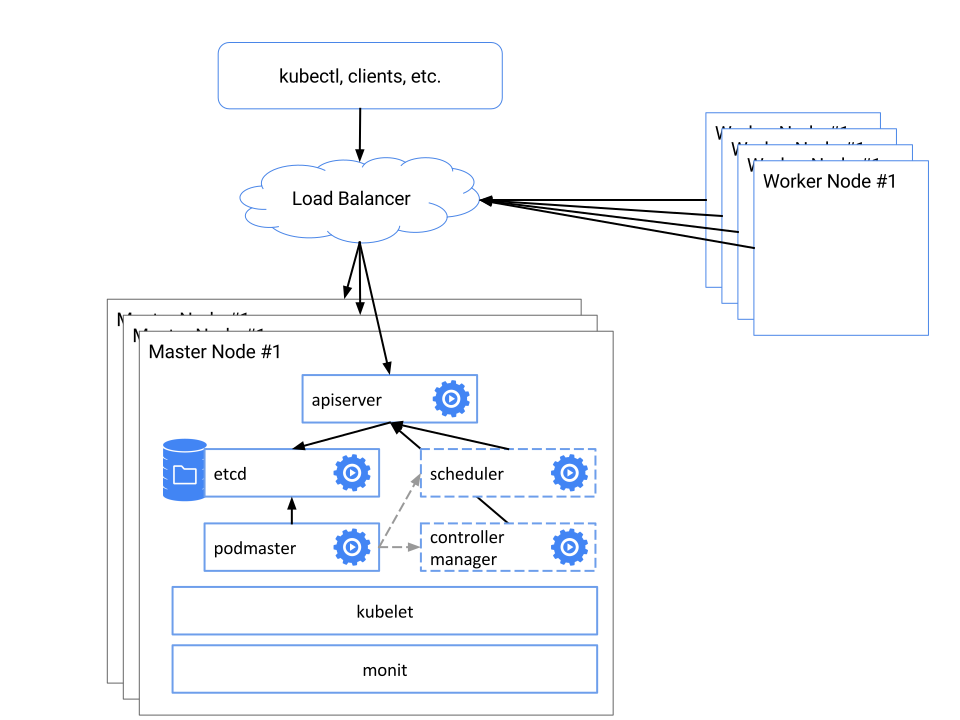

# Kubernetes 部署

## 介绍

本项目通过 Ansible 自动化脚本完成 Kubernetes 集群的一键部署，降低安装成本，提高生产效率

## 截图

**Dashboard**


**Monitoring Grafana**


## 部署图


 
## 快速体验

### 集群环境

**软件版本**

| 软件名称        | 版本           |
| ------------- |:-------------:|
| centos      | 7.4.1708 |
| docker      | 18.03.1   |
| kubernetes      | 1.10.2 |
| flannel      | 0.10.0    |
| etcd      | 3.3.4    |

**kubernetes 组件版本**

| kubernetes 组件        | 版本           |
| ------------- |:-------------:|
| dashboard      | 1.8.3 |
| kube-dns      | 1.14.10   |
| heapster      | 1.5.2 |
| nginx-ingress      | 0.1 4.0    |
| helm      | 2.9.0  |

> kubernetes 相关镜像：https://hub.docker.com/u/ifnoelse/

**机器节点**

| 服务器名      | ip           | 安装的组件           |
| ------------- | ------------- |-------------|
| node-1      | 192.168.100.101 |haproxy，keepalived，kubernetes master，kubernetes client，flannel，etcd，helm client|
| node-2      | 192.168.100.102 |haproxy，keepalived，kubernetes master，kubernetes node，flannel，etcd，docker|
| node-3      | 192.168.100.103 |kubernetes node，flannel，etcd，docker|

> 1、以上节点通过 Vagrant 准备即可，Vagrantfile 在项目根目录下 <br />
> 2、所有的节点之间已经针对用户 ifnoelse 做了免秘钥登录 <br />
> 3、所有的节点已经关闭了防火墙、IPv6 及 selinux <br />
> 4、所有的节点名称与 ip 的本地解析已经在各个节点的 /etc/hosts 文件中配置好了

### 一键部署

**1 下载部署代码**

[点击下载](https://github.com/ifnoelse/kubernetes-deploy/archive/master.zip)

**2 启动虚拟机**

``` bash
cd kubernetes-deploy
vagrant up
```

**3 下载安装文件**

3.1 复制 res 文件夹到 kubernetes-deploy 目录

res文件夹内的内容如下：
- cfssl-certinfo_linux-amd64
- cfssljson_linux-amd64
- cfssl_linux-amd64
- docker-18.03.1-ce.tgz
- etcd-v3.3.4-linux-amd64.tar.gz
- flannel-v0.10.0-linux-amd64.tar.gz
- kubernetes-server-v1.10.2-linux-amd64.tar.gz

> 1、res 文件夹下载地址：https://pan.baidu.com/s/1kVgn2ib 密码：dsss <br />
> 2、res 中的文件也可以自行到官网下载，之后将压缩包放入 res 目录即可，文件名叫什么都可以
    
3.2 复制 images 文件夹到 kubernetes-deploy 目录（可选步骤）

images文件夹内的内容如下：
- defaultbackend_1.4.tar
- heapster-amd64_v1.5.2.tar
- heapster-grafana-amd64_v4.4.3.tar
- heapster-influxdb-amd64_v1.3.3.tar
- k8s-dns-dnsmasq-nanny-amd64_1.14.10.tar
- k8s-dns-kube-dns-amd64_1.14.10.tar
- k8s-dns-sidecar-amd64_1.14.10.tar
- kubernetes-dashboard-amd64_v1.8.3.tar
- nginx-ingress-controller_0.14.0.tar
- pause-amd64_3.1.tar

> 1、images 文件夹下载地址：https://pan.baidu.com/s/1cAXRsE 密码：ot65 <br />
> 2、如果希望从本导入相关镜像，比如 dashboard 等 kubernetes 相关组件的镜像，则需要下载images文件，不导入也可以，安装相关组件时会从网上自动下载，如果网络不好可能比较慢

**4 一键安装 kubernetes 集群**

登录虚拟机（用户名：ifnoelse，密码：ifnoelse）执行以下命令
``` bash
cd /vagrant/ansible
ansible-playbook -i hosts.yaml install.yaml
```

> 1、虚拟机启动之后已经装好了 Ansible <br />
> 2、可以通过修改 hosts.yaml 来设置安装节点，hosts 中的节点信息可以是域名或者 ip

**5 验证安装结果**

``` bash
[ifnoelse@node-1 ansible]$ kubectl get node
NAME              STATUS    ROLES     AGE       VERSION
192.168.100.102   Ready     <none>    8m        v1.10.2
192.168.100.103   Ready     <none>    8m        v1.10.2
```

``` bash
[ifnoelse@node-1 ansible]$ kubectl get pod -n kube-system
NAME                                    READY     STATUS    RESTARTS   AGE
heapster-7b494f7f58-tpmc5               1/1       Running   0          7m
kube-dns-755cc6cd9b-nk4sv               3/3       Running   0          7m
kubernetes-dashboard-57c9c44454-rm9mv   1/1       Running   0          7m
monitoring-grafana-7554bb49f5-t7cq4     1/1       Running   0          7m
monitoring-influxdb-5d6f4b996c-s2jsz    1/1       Running   0          7m
```

``` bash
[ifnoelse@node-1 ansible]$ kubectl cluster-info
Kubernetes master is running at http://localhost:8080
Heapster is running at http://localhost:8080/api/v1/namespaces/kube-system/services/heapster/proxy
KubeDNS is running at http://localhost:8080/api/v1/namespaces/kube-system/services/kube-dns:dns/proxy
monitoring-grafana is running at http://localhost:8080/api/v1/namespaces/kube-system/services/monitoring-grafana/proxy
monitoring-influxdb is running at http://localhost:8080/api/v1/namespaces/kube-system/services/monitoring-influxdb/proxy

To further debug and diagnose cluster problems, use 'kubectl cluster-info dump'.
```

**6 访问dashboard**

1. 访问 dashboard 所需的证书及 token 在 cluster_manager 机器的 tmp_dashboard_dir 目录中

``` bash
[ifnoelse@node-1 dashboard]$ pwd;ls -l
/home/ifnoelse/kubernetes-deploy/install_files/dashboard
total 12
-rw-rw-r--. 1 ifnoelse ifnoelse 2597 May  2 21:08 admin.p12
-rw-rw-r--. 1 ifnoelse ifnoelse 2533 May  2 21:08 ca.p12
-rw-rw-r--. 1 ifnoelse ifnoelse  905 May  2 21:08 token.txt
```

2. 将客户端证书 admin.p12 导入浏览器


3. 将根证书 ca.p12 导入浏览器（可选）


4. 访问地址：https://192.168.100.100:8443/api/v1/namespaces/kube-system/services/https:kubernetes-dashboard:/proxy

5. 通过 token 登录 dashboard

> 1、cluster_manager 服务器在 hosts.yaml 中定义，默认值为 node-1 <br />
> 2、tmp_dashboard_dir 路径在 group_vars/all.yaml 中定义，默认值为 /home/ifnoelse/tmp/dashboard

**7 访问 grafana**

访问地址：https://192.168.100.100:8443/api/v1/namespaces/kube-system/services/monitoring-grafana/proxy

> 访问 grafana 同样需要导入客户端证书，如果已经导入过了，这里就不需要再次导入了

**8 一键卸载 Kubernetes 集群**

登录虚拟机（用户名：ifnoelse，密码：ifnoelse）执行以下命令
``` bash
cd /vagrant/ansible
ansible-playbook -i hosts.yaml uninstall.yaml
```